# Polkastarter

The purpose of the project was to create a DApp that will allow teams working on a Polkadot Parachain create a new crowd loan and thus participate in the Parachain auction mechanism running on the Relay chain.

The official Polkadot repository does include an implementation of the crowdloan module i.e. a FRAME pallet that one can integrate into a substrate runtime. However, none of the runtimes did include that module. Consequently, The first step was to fork the official Polkadot repository and integrate into a one of the runtimes. We decided to integrate the module into the Kusama runtime. 

## Crowdloan Module

The crowdloan module is one allows parachain projects to run a public campaign which will allow to raise the funds needed to bid for an open auction running on the Relay chain. The participation is open and anyone willing to help the project win the auction can contribute an amount of native token i.e. DOT, KSM. 

The module stores all contribution as a key value pair and the total set of contributors along with their contribution is stored in a child-trie root which the parachain can later use to verify whether or not an account id has contributed to a crowdloan or not. The actual decision of how to reward the contributors is out of the crowdloan scope and it's dependent on each project separately. For example some project might decide to reward all their contributors with the native token of the parachain.

There are some limitation when it comes to contributing into a crowdloan namely users cannot send an amount smaller that the value defined in the `MinContribution` parameter. At the same time, the total fund raised can not exceed the `cap` value. These parameters are set during the creation of a crowdloan.

Creating a crowdloan is also an action that can be performed by anyone. The requirement is that the creator sends a deposit which should much the constant value of `SubmissionDeposit`  which is set on the Relay chain. In addition to that, a new parachain has to be registered with the Registar module. This is yet another extrinsic that needs to be send to the Polkadot runtime.

The closing time (a block number) of the campaign is set during the creation time. If the campaign is not successful by the end of the closing time i.e. did not outbid the other participants for a slot, the campaign renders itself as retired. The closing time can be chosen to span multiple auctions if the creator wishes so. 

When the campaign is retired, the fund is returned back to their contributors. Note that, contributors will have to manually claim those funds during a period as defined in the `RetirementPeriod` parameter. Any unclaimed contributions after the retirement period will be considered `orphaned`. The module itself allows the runtime to set a OrphanedFunds handler which will implement the logic that will decide what will happen to the orphaned fund. Since there is no runtime yet supporting the crowdload module, we envision that the handler would probably take the funds and place them into the Treasury.

When the parachain auction enters its ending period, each of the created crowdloan campaigns will automatically place a bid at the end of each block (if additional funds have been added since the last bid).

One important note is that the point of the crowdloan campaign is to allow a parachain to bid for an auction that will ultimately allow it to get a slot allocated. The parachain itself is essentially yet another substrate (not necessarily as parachain are not obliged to be built using the Substrate blockchain); thus the deploy data for the parachain (more specifically the code hash and head data) should also be registered with the crowdloan campaign. Luckily, the module does allow the owner of the campaign to set the deploy data at any point via an specific extrinsic call. Once set though it cannot be changed. There is no particular restriction regarding then the data should be set; however, a good practise would be to set it before any contribution is received so contributors can verify the runtime code of the parachain their assisting to win the auction.

Finally, a campaign that is a succesful winner of the slot auction can claim it via the onboard extrinsic which is invoked once but only after the deploy data is set. The accumulated funds are locked for as long as the parachain is active. Once the parachain becomes inactive, it is up to the individual parachains to ensure that the funds are returned to the crowdloan's module sub-account are returned back to the original contributors. There is specific extrinsic (begin_retirement) that can be called to initiate the retirement once the parachain is removed from its slot.

## Crowd loan module interface

Following are the functions that are supported by the module. We can use extrinsic or queries to interact with those functions.

### create

This is the function that allows anyone to create a new crowdloan campaign. 

Parameters:

1. **paraId**: the id of the registered parachain for which the campaign will be created
2. **cap**: the total amount to be raised
3. **firstSlot**: First slot in range to bid on
4. **lastSlot**: Last slot in range to bid on
5. **end:**  Block number after which the funding must have succeeded. If not successful at this number then everyone may withdraw their funds.
5. **verifier:** An optional verifier. If exists, contributions must be signed by verifier.

Note that there is a restriction in the code about the values of firstSlot and lastSlot. Basically the distance cannot be greater than 3.

```jsx
ensure!(last_slot <= first_slot + 3u32.into(), Error::<T>::LastSlotTooFarInFuture);
```

### contribute

Allow users to contribute into the campaign's fund. This will transfer some balance over to fund a parachain.

Parameters:

1. **index:** This is essentially the id of the fund; A monotonic value that is incremented everytime a new campaign is created. This value will need to be associated with a campaign via some off-chain service that will provide additional metadata about the campaign i.e. name of the project, website, parachain code etc.
2. **value:** The size of the contribution i.e. amount of DOT, KSM
3. **signature:** A valid signature maybe required in order to accept the contribution. This is required if a verifier was set when creating the campaign.

### fix_deploy_data

Set the deploy data of the funded parachain if not already set. Once set, this cannot be changed again.

The function can be invoked by the owner of the fund i.e origin must be the fund owner.

Parameters:

1. **index:** The index of the fund whose deploy data will be set.
2. **code_hash:** is the hash of the parachain's Wasm validation function.
3. **initial_head_data:** The parachain's initial head data.

### onboard

Complete onboarding process for a winning parachain fund. This can be called once by any origin once a fund wins a slot and the fund has set its deploy data (using fix_deploy_data).

Parameters:

1. **index**: is the fund index
2. **para_id:** is the parachain index that this fund won.

### begin_retirement

Note that a successful fund has lost its parachain slot, and place it into retirement.

Parameters:

1. **index**: is the fund index

### withdraw

Withdraw full balance of a contributor to an unsuccessful or off-boarded fund.

Parameters:

1. **who:** The account id of the contributor that wants to withdraw the previously deposited contributions
2. **index**: is the fund index

### dissolve

Remove a fund after either: it was unsuccessful and it timed out; or it was successful but it has been retired from its parachain slot. This places any deposits that were not withdrawn into the treasury.

Parameters:

1. **index**: is the fund index

## Usage

Below we put all the aforementioned theory into practise by running the modified runtime and use a DApp to interact with the function defined above.

### Running an instance of Westend locally

The crowloan module is has been recently added to the master branch of the official Polkadot repo. To test though all those changes we have to run an entire runtime including dummy parachains locally. Luckily, the team at Parity has built a CLI tool that allows us to setup a runtime (Relay plus parachains) on a local machine.

Following are the steps to set a local Kusama network using the changes we made to the code.

Install the CLI tool

```jsx
yarn global add polkadot-launch
```

To use polkadot-launch, you need to have binary files for a `polkadot` relay chain and a `rococo-collator`.

You can generate these files by cloning the projects and building it. 

```jsx
git clone -b git@github.com:paritytech/polkadot.git
cd polkadot
cargo build --release
```

This will take some time. Once finished you can access the binary file under target > release > polkadot. 

Alternatively, you can download a pre-built binary here

<TODO>

Copy the binary into a specific directory

```jsx
mkdir ../binaries
cp target/release/polkadot ../binaries/polkadot
```

Clone the polkadot-launch repo and change the config file

```jsx
git clone git@github.com:paritytech/polkadot-launch.git
```

Open the config.json file and replace the content with the following lines

```jsx
{
	"relaychain": {
		"bin": "../binaries/polkadot",
		"chain": "westend-local",
		"nodes": [
			{
				"name": "alice",
				"wsPort": 9944,
				"port": 30444
			},
			{
				"name": "bob",
				"wsPort": 9955,
				"port": 30555
			},
			{
				"name": "charlie",
				"wsPort": 9966,
				"port": 30666
			},
			{
				"name": "dave",
				"wsPort": 9977,
				"port": 30777
			}
		]
	},
	"parachains": [

	],
	"hrmpChannels": [
		{
			"sender": 200,
			"recipient": 300,
			"maxCapacity": 8,
			"maxMessageSize": 512
		}
	],
	"types": {
	}
}
```

Finally, start the relay chain along with the parachains

```jsx
polkadot-launch config.json
```

Now you have a running instance of a local Westend runtime.

One simple an effective way to start interacting with the runtime is by using the Polkadot.js App which is essentially a generic DApp which you can use to quickly view any Polkadot runtime.

```jsx
git clone git@github.com:polkadot-js/apps.git
cd apps
yarn install
yarn start
```

Now if you open your browser at [http://localhost:3000](http://localhost:3000) you can see the 

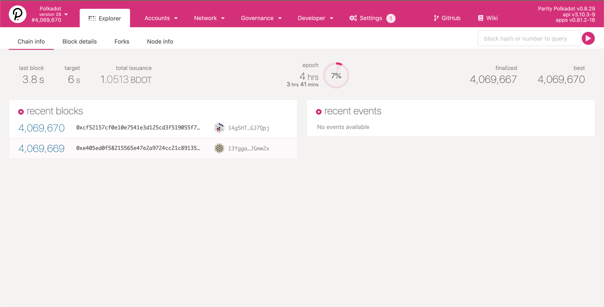

This is very powerful UI which acts as an explorer, a DApp that you can use to send extrinsic, query the runtime state, participate in governance and many more.

By default the DApp will be connected to one of the mainnet networks. However, in our case we would like to interact with the local network we just launched. To do so we would need to click on the top right corner and change the rpc node to the local instance.

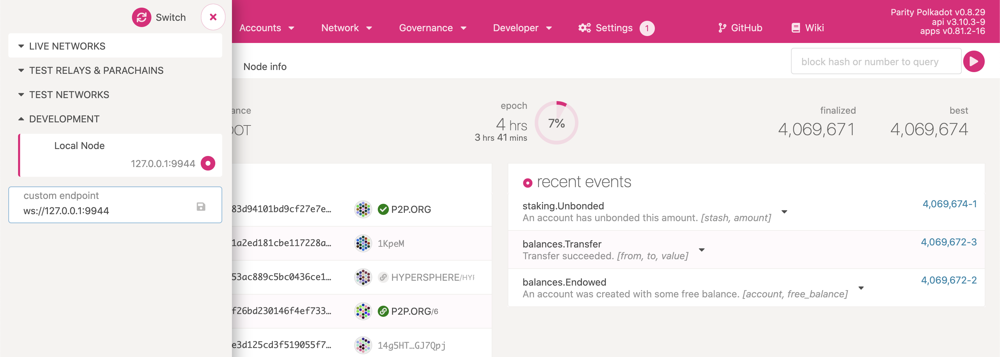

Polkadot launch started three validator instances; one of those instances is running an RPC endpoint at ws://127.0.0.1:9944

Now click on the switch button and you'll be connected to the local network.

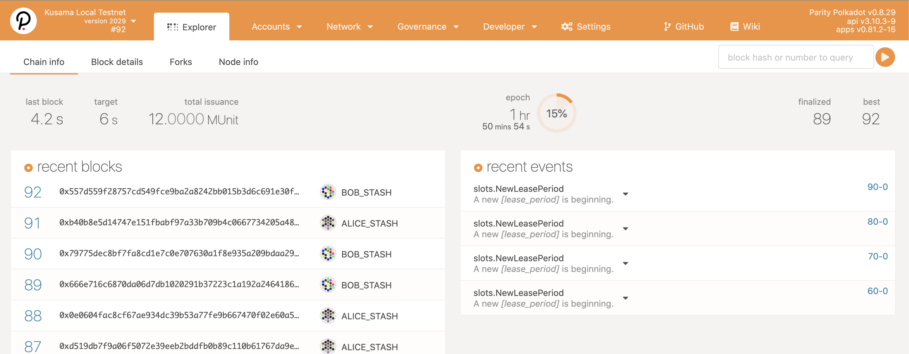

We will first need to register the Parachain with the Registar module. This is a simple extrinsic which we can send via the Apps UI. Select Developer > Extrinsics from the menu and select registar from the dropdown.

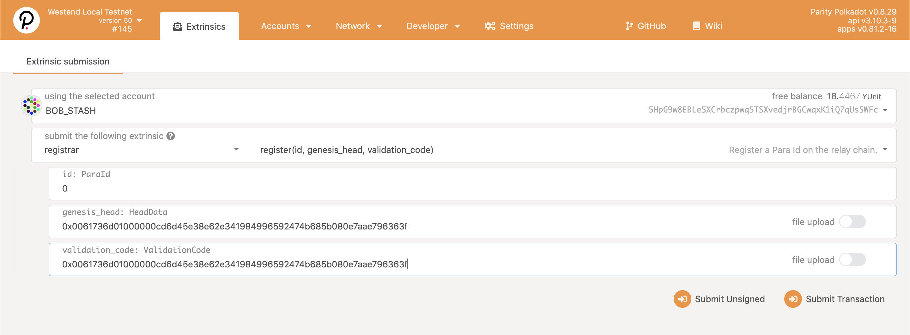

Use the following value for the genesis_head and validator_code:

0x0061736d01000000cd6d45e38e62e341984996592474b685b080e7aae796363f

Finally you can start interacting with the crowdloan module via the generic extrinsic UI. Select crowloan module from the dropdown.

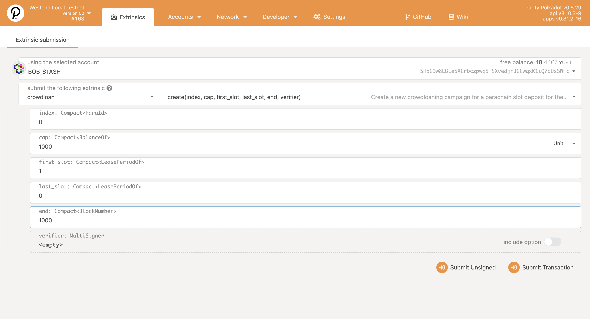

We have built a separate DApp that is purely for the purpose of the purpose of interacting with the crowdloan module. However, we can still use the above UI to create a new campaign. 

Fill out the above form with some values (check the meaning of each property in the section above) and click Submit Transaction.

[]()

Click Sign and Submit and the signed transaction will be submitted to the relay chain. The result of the transaction is a new campaign created and registered. 

Now let's switch to Alice's account and make contribution to this fund.

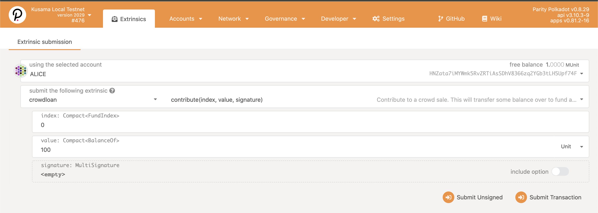

Again click Submit Transaction and then Sign and Send.

We can check the status of a fund by sending a query. Select Developer > Chain State. Select crowdloan and funds from the two drop downs and enter 0, which is the index of the fund we created (fund index is a monotonic value that increments every time a new fund is created)

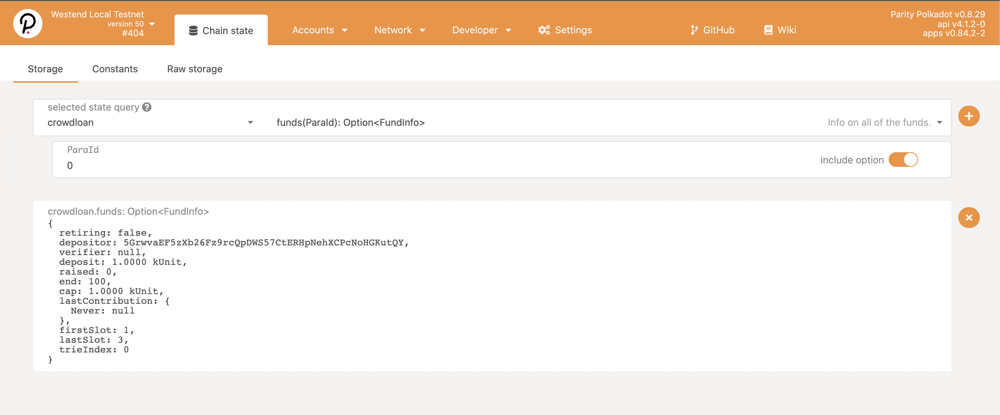

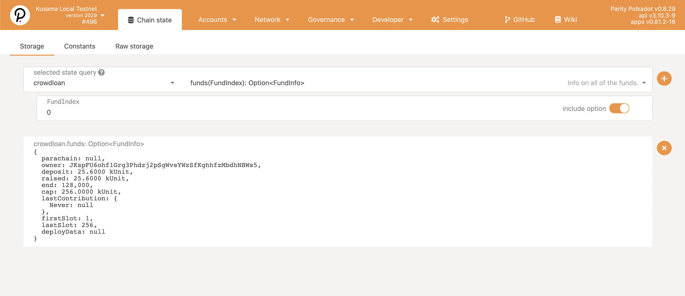

### Running the DApp

We demonstrated how one can create, contribute and query the fund data using the generic PolkadotJS DApp. However, we have built a custom DApp which is much simpler and it let's users directly interact with a fund. It also allows anyone to create a new fund.

To make any interactions with the DApp, the polkadot browser extension will have to be installed on the users machine and follow the steps to create a new account.

One can download it from [https://polkadot.js.org/extension/](https://polkadot.js.org/extension/)

In addition to that, we would need to fund the wallet we just created with some DOT so we can interact with the relay chain. Luckily as we saw earlier, the local network we launched does have some test account with some funds. We can use the PolkadotJS DApp to transfer some amount to the newly created account.

Select accounts form the menu and click the send button next to Alice name.

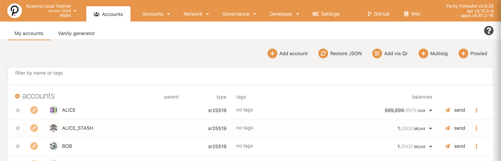

Then copy the address of the account by clicking on the browser extention we just installed.

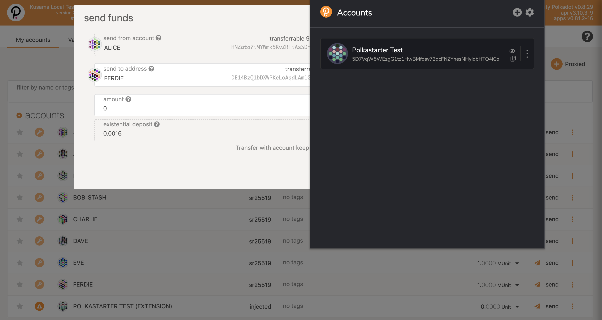

Finally enter the amount you want to send from Alice's account to the new account and click make transfer. 

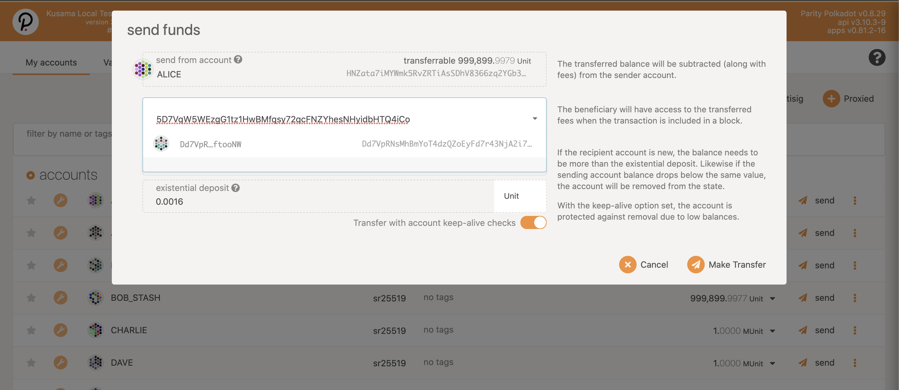

Ok now that the new account has got some fund, let's clone the DApp 

TODO:: add the Polkastarter crowdloan DApp repo

Install the dependencies and run the DApp

```jsx
yarn install
yarn start
```

Now visit [http://localhost:3000](https://localhost:3000) 

The DApp allows users to register the parachain for which the campaign will be created with the Registar module.

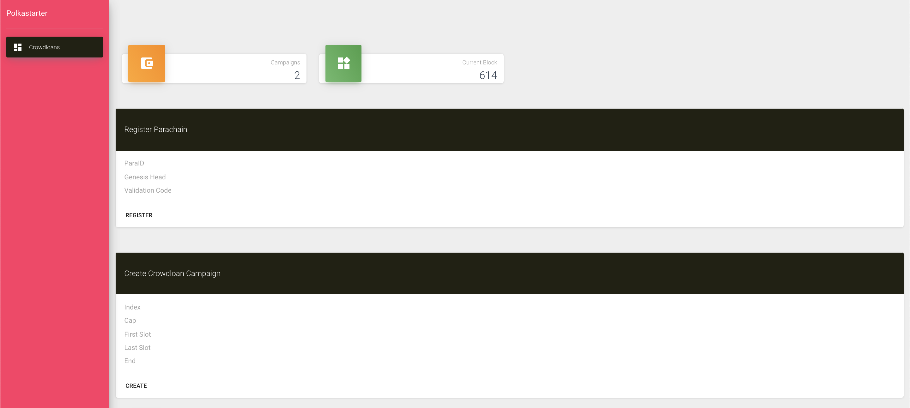

For testing purposes you can use the following value for the genesis head and validation code inputs; the paraId is a monotonic numeric value starting from 0.

0x0061736d01000000cd6d45e38e62e341984996592474b685b080e7aae796363f

The second step once the parachain is registered, is to create a new crowload campaign using the form.

After creating a campaign user will be able to interact with it by sending a contribution, for example.

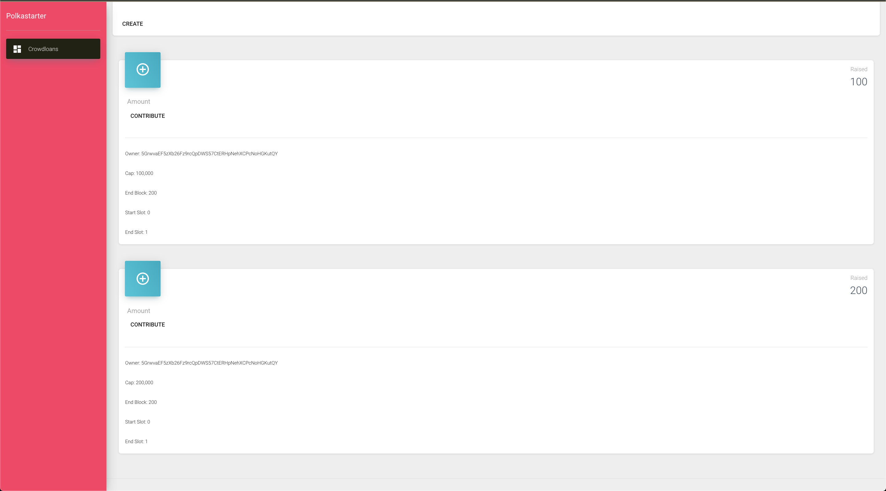

## References

1. Polkadot fork including the integration of the crowdloan module into the Kusama runtime [https://github.com/Apocentre/polkadot/pull/1/files](https://github.com/Apocentre/polkadot/pull/1/files)
2. [https://github.com/paritytech/polkadot-launch](https://github.com/paritytech/polkadot-launch)
3. [https://github.com/paritytech/cumulus](https://github.com/paritytech/cumulus)
4. [https://polkadot.js.org/apps/](https://polkadot.js.org/apps/)
5. [https://github.com/polkadot-js/apps](https://github.com/polkadot-js/apps)
6. [https://polkadot.js.org/api](https://polkadot.js.org/docs/api/)
7. [https://github.com/polkadot-js/api](https://github.com/polkadot-js/api)
8. [https://polkadot.js.org/extension/](https://polkadot.js.org/extension/)
